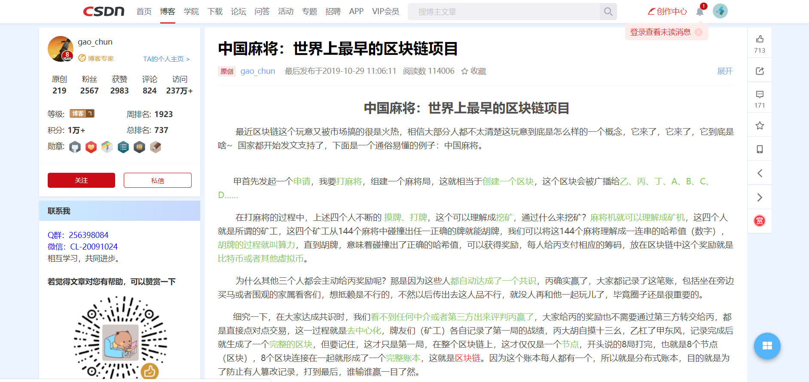
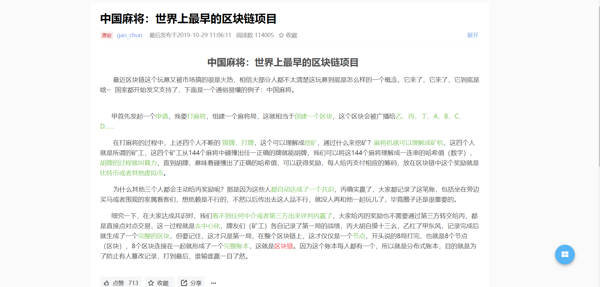

>由于CSDN博客界面过于臃肿，平时使用的时候总是分心。昨天查找一个博客的时候，发现那篇博客背景实在是亮瞎了我的眼，最后实在无法忍受，就自己写了一个油猴插件脚本来精简博客。

### 提示

首先保证在浏览器中安装了**油猴插件**或者**暴力猴**。

浏览器支持**Chrome、Firefox以及Chromium版的Edge**。

关于具体的安装方法，在各大博客网站中可以下载安装使用。由于这个脚本是为CSDN定制的，因此只会在CSDN中生效。其他博客网站例如简书、博客园、掘金无法生效。

### 使用方法

#### 0. 界面

#### 1. 安装

油猴插件： [CSDN阅读模式](https://greasyfork.org/zh-CN/scripts/401026-csdn%E9%98%85%E8%AF%BB%E6%A8%A1%E5%BC%8F)